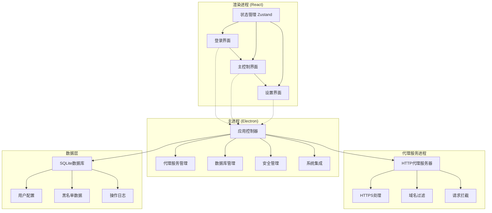

# 崔子瑾诱捕器 - 技术规格文档

## 🔧 技术架构详细设计

### 1. 应用架构图



### 2. 核心模块设计

#### 2.1 代理服务器模块
```typescript
// src/main/proxy/ProxyServer.ts
export class ProxyServer {
  private server: http.Server;
  private httpsServer: https.Server;
  private port: number;
  private blockedDomains: Set<string>;
  
  async start(config: ProxyConfig): Promise<void> {
    // 启动HTTP代理服务器
    // 生成自签名证书
    // 配置HTTPS处理
  }
  
  async stop(): Promise<void> {
    // 停止代理服务器
    // 清理资源
  }
  
  updateBlocklist(domains: string[]): void {
    // 更新黑名单
    // 通知所有连接
  }
  
  private handleRequest(req: http.IncomingMessage, res: http.ServerResponse): void {
    // 处理HTTP请求
    // 检查域名是否被阻止
    // 返回拦截页面或转发请求
  }
  
  private handleConnect(req: http.IncomingMessage, socket: net.Socket, head: Buffer): void {
    // 处理HTTPS CONNECT请求
    // 建立隧道或拒绝连接
  }
}
```

#### 2.2 系统集成模块
```typescript
// src/main/system/SystemIntegration.ts
export class SystemIntegration {
  async setSystemProxy(port: number): Promise<boolean> {
    // Windows: 修改注册表
    // macOS: 使用networksetup命令
    // Linux: 修改环境变量
  }
  
  async installCertificate(certPath: string): Promise<boolean> {
    // 安装根证书到系统信任存储
  }
  
  async detectProxyChanges(): Promise<boolean> {
    // 监控系统代理设置变化
  }
  
  async protectProcess(): Promise<void> {
    // 进程保护机制
  }
}
```

#### 2.3 数据访问层
```typescript
// src/main/database/DatabaseManager.ts
export class DatabaseManager {
  private db: Database;
  
  async initialize(): Promise<void> {
    // 初始化SQLite数据库
    // 创建表结构
    // 数据迁移
  }
  
  async authenticateUser(password: string): Promise<boolean> {
    // 验证用户密码
  }
  
  async getBlockedSites(): Promise<BlockedSite[]> {
    // 获取黑名单网站
  }
  
  async addBlockedSite(site: CreateBlockedSiteDto): Promise<BlockedSite> {
    // 添加网站到黑名单
  }
  
  async updateSiteStatus(id: string, enabled: boolean): Promise<void> {
    // 更新网站启用状态
  }
  
  async resetAllSites(): Promise<void> {
    // 重置所有网站状态
  }
}
```

### 3. 前端架构设计

#### 3.1 状态管理
```typescript
// src/renderer/store/useAppStore.ts
interface AppState {
  // 认证状态
  isAuthenticated: boolean;
  user: User | null;
  
  // 网站管理
  blockedSites: BlockedSite[];
  isLoading: boolean;
  
  // 代理状态
  proxyStatus: 'running' | 'stopped' | 'error';
  interceptCount: number;
  
  // UI状态
  theme: 'light' | 'dark';
  currentPage: string;
}

interface AppActions {
  // 认证操作
  login: (password: string) => Promise<boolean>;
  logout: () => void;
  
  // 网站管理操作
  loadBlockedSites: () => Promise<void>;
  addSite: (url: string) => Promise<void>;
  toggleSite: (id: string) => Promise<void>;
  deleteSite: (id: string) => Promise<void>;
  resetAllSites: () => Promise<void>;
  
  // 代理操作
  startProxy: () => Promise<void>;
  stopProxy: () => Promise<void>;
}
```

#### 3.2 组件架构
```typescript
// 页面组件
src/renderer/pages/
├── LoginPage.tsx          # 登录页面
├── DashboardPage.tsx      # 主控制台
├── SettingsPage.tsx       # 设置页面
└── EmergencyPage.tsx      # 紧急重置页面

// 通用组件
src/renderer/components/
├── common/
│   ├── Button.tsx         # 按钮组件
│   ├── Input.tsx          # 输入框组件
│   ├── Switch.tsx         # 开关组件
│   └── Modal.tsx          # 模态框组件
├── layout/
│   ├── Header.tsx         # 顶部导航
│   ├── Sidebar.tsx        # 侧边栏
│   └── Layout.tsx         # 布局容器
└── features/
    ├── SiteList.tsx       # 网站列表
    ├── SiteCard.tsx       # 网站卡片
    ├── AddSiteForm.tsx    # 添加网站表单
    └── StatusBar.tsx      # 状态栏
```

### 4. 安全机制实现

#### 4.1 进程保护
```typescript
// src/main/security/ProcessProtection.ts
export class ProcessProtection {
  private watchdog: NodeJS.Timer;
  private childProcesses: ChildProcess[] = [];
  
  async initialize(): Promise<void> {
    // 启动看门狗进程
    // 监控主进程状态
    // 设置进程重启机制
  }
  
  async protectMainProcess(): Promise<void> {
    // 防止进程被强制结束
    // 隐藏进程信息
  }
  
  private startWatchdog(): void {
    // 定期检查进程状态
    // 自动重启异常进程
  }
}
```

#### 4.2 配置加密
```typescript
// src/main/security/ConfigEncryption.ts
export class ConfigEncryption {
  private readonly algorithm = 'aes-256-gcm';
  private key: Buffer;
  
  async encryptConfig(data: any): Promise<string> {
    // 加密配置数据
  }
  
  async decryptConfig(encryptedData: string): Promise<any> {
    // 解密配置数据
  }
  
  private generateKey(): Buffer {
    // 生成加密密钥
  }
}
```

### 5. 网络拦截实现

#### 5.1 HTTP代理处理
```typescript
// src/main/proxy/HttpHandler.ts
export class HttpHandler {
  handleRequest(req: http.IncomingMessage, res: http.ServerResponse): void {
    const url = new URL(req.url!);
    const domain = url.hostname;
    
    if (this.isBlocked(domain)) {
      this.sendBlockedPage(res, domain);
      this.logInterception(domain);
      return;
    }
    
    this.forwardRequest(req, res);
  }
  
  private sendBlockedPage(res: http.ServerResponse, domain: string): void {
    const html = this.generateBlockedPageHtml(domain);
    res.writeHead(200, { 'Content-Type': 'text/html' });
    res.end(html);
  }
  
  private generateBlockedPageHtml(domain: string): string {
    return `
      <!DOCTYPE html>
      <html>
        <head>
          <title>访问被阻止</title>
          <style>
            body { 
              font-family: -apple-system, BlinkMacSystemFont, 'Segoe UI', Roboto;
              text-align: center; 
              padding: 50px;
              background: linear-gradient(135deg, #667eea 0%, #764ba2 100%);
              color: white;
            }
            .container {
              max-width: 500px;
              margin: 0 auto;
              background: rgba(255,255,255,0.1);
              padding: 40px;
              border-radius: 20px;
              backdrop-filter: blur(10px);
            }
          </style>
        </head>
        <body>
          <div class="container">
            <h1>🚫 访问被阻止</h1>
            <p>网站 <strong>${domain}</strong> 已被崔子瑾诱捕器阻止访问</p>
            <p>如需解除限制，请返回应用进行设置</p>
          </div>
        </body>
      </html>
    `;
  }
}
```

#### 5.2 HTTPS处理
```typescript
// src/main/proxy/HttpsHandler.ts
export class HttpsHandler {
  private certificates: Map<string, tls.SecureContext> = new Map();
  
  handleConnect(req: http.IncomingMessage, socket: net.Socket, head: Buffer): void {
    const [hostname, port] = req.url!.split(':');
    
    if (this.isBlocked(hostname)) {
      socket.write('HTTP/1.1 200 Connection Established\r\n\r\n');
      this.createHttpsProxy(socket, hostname);
      return;
    }
    
    this.forwardConnect(req, socket, head);
  }
  
  private createHttpsProxy(socket: net.Socket, hostname: string): void {
    const cert = this.getCertificate(hostname);
    const tlsSocket = new tls.TLSSocket(socket, {
      secureContext: cert,
      isServer: true
    });
    
    tlsSocket.on('data', (data) => {
      // 解析HTTPS请求并返回阻止页面
      this.handleHttpsRequest(tlsSocket, data, hostname);
    });
  }
}
```

### 6. 构建和部署配置

#### 6.1 Electron Builder配置
```json
// electron-builder.json
{
  "appId": "com.cuizijin.trap",
  "productName": "崔子瑾诱捕器",
  "directories": {
    "output": "dist"
  },
  "files": [
    "build/**/*",
    "node_modules/**/*"
  ],
  "mac": {
    "category": "public.app-category.utilities",
    "icon": "assets/icon.icns",
    "hardenedRuntime": true,
    "entitlements": "assets/entitlements.mac.plist"
  },
  "win": {
    "target": "nsis",
    "icon": "assets/icon.ico",
    "requestedExecutionLevel": "requireAdministrator"
  },
  "linux": {
    "target": "AppImage",
    "icon": "assets/icon.png"
  }
}
```

#### 6.2 开发脚本
```json
// package.json scripts
{
  "scripts": {
    "dev": "concurrently \"npm run dev:main\" \"npm run dev:renderer\"",
    "dev:main": "electron-webpack dev",
    "dev:renderer": "vite",
    "build": "npm run build:main && npm run build:renderer",
    "build:main": "electron-webpack",
    "build:renderer": "vite build",
    "dist": "electron-builder",
    "dist:mac": "electron-builder --mac",
    "dist:win": "electron-builder --win",
    "dist:linux": "electron-builder --linux"
  }
}
```

---

**文档版本：** v1.0  
**最后更新：** 2025-06-28
